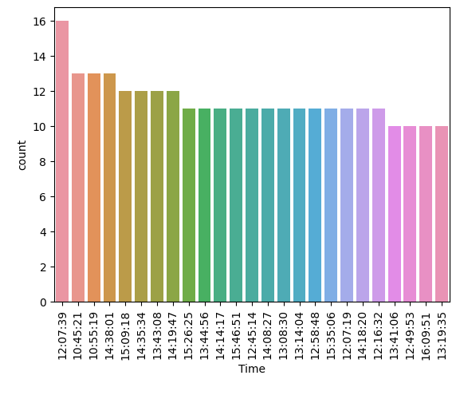

# Laporan Proyek Machine Learning

### Nama : Nisa Febrianti

### Nim : 211351103

### Kelas : TIF Pagi A

## Domain Proyek


Dalam project ini, fokusnya adalah menganalisis pola pembelian di toko roti melalui Market Basket Analysis dengan menggunakan algoritma Apriori. Dengan menggunakan Market Basket Analysis, kita dapat mengidentifikasi asosiasi antara produk, memberikan pemahaman lebih lanjut mengenai preferensi pelanggan, dan membantu toko roti dalam meningkatkan penjualan. Melalui project ini, kita dapat mengoptimalkan strategi penjualan, menyusun penawaran paket yang menarik, dan meningkatkan pengalaman pelanggan.

## Business Understanding

### Problem Statements

- Kurangnya pemahaman mendalam mengenai pola pembelian pelanggan
- Kurangnya wawasan ini menjadi hambatan dalam mengoptimalkan strategi penjualan dan meningkatkan pengalaman pelanggan.

### Goals

- Mengidentifikasi produk-produk yang sering dibeli bersamaan oleh pelanggan toko roti.
- Memberikan rekomendasi strategi pemasaran yang dapat meningkatkan penjualan dan pengalaman pelanggan berdasarkan temuan analisis Market Basket.

### Solution statements

- Membangun suatu sistem yang dapat mempelajari suatu data (Machine Learning) untuk melakukan Market Basket Analysis pada data produk penjualan.
- Sistem berjalan dengan menggunakan algoritma Apriori yang dinilai cocok untuk melakukan Market Basket Analysis pada dataset ini.

## Data Understanding

Dataset yang digunakan berasal dari situs Kaggle. Dataset ini mengandung 21293 entries dan 4 columns<br>

Link Dataset: [Transaction from bakery](https://www.kaggle.com/datasets/sulmansarwar/transactions-from-a-bakery).

Variabel-variabel yang terdapat pada Dataset adalah sebagai berikut:

- Date = Tanggal Transaksi
- Time = Waktu Transaksi
- Transaction = Jumlah Transaksi
- Item = Produk Penjualan

## Data Exploration

Berikut adalah sample dari dataset kita:

```bash
    Date	    Time	Transaction	    Item
0	2016-10-30	09:58:11	1	        Bread
1	2016-10-30	10:05:34	2	        Scandinavian
2	2016-10-30	10:05:34	2	        Scandinavian
3	2016-10-30	10:07:57	3	        Hot chocolate
4	2016-10-30	10:07:57	3	        Jam
```

Kita akan melihat info dataset kita menggunakan fungsi df.info() dengan hasil sebagai berikut:

```bash
RangeIndex: 21293 entries, 0 to 21292
Data columns (total 4 columns):
 #   Column       Non-Null Count  Dtype
---  ------       --------------  -----
 0   Date         21293 non-null  object
 1   Time         21293 non-null  object
 2   Transaction  21293 non-null  int64
 3   Item         21293 non-null  object
dtypes: int64(1), object(3)
```

## EDA

Sebelum melanjutkan pada tahap persiapan data dan modeling, kita sebaiknya memahami dulu dataset yang akan kita gunakan. <br>

Disini kita akan melihat data penjualan terbanyak berdasarkan tanggal, kita mendapatkan hasil bahwa dari grafik ini menunjukkan bahwa data penjualan terbanyak adalah pada tanggal 2017-04-02


Setelah itu, kita akan melihat data penjualan terbanyak berdasarkan jam. Dari grafik ini menunjukkan bahwa data penjualan terbanyak adalah pada jam 12:07:39


Selanjutnya, kita akan melihat data penjualan terbanyak berdasarkan item atau produk penjualan. Dari grafik menunjukkan bahwa data penjualan terbanyak adalah pada item coffee


Selanjutnya, kita akan melihat data penjualan terbanyak berdasarkan bulan. Dari grafik menunjukkan bahwa data penjualan terbanyak adalah pada bulan November 2016.


Selanjutnya, kita akan melihat data penjualan terbanyak berdasarkan hari. Dari grafik menunjukkan bahwa data penjualan terbanyak adalah pada hari Sabtu.


## Data Preparation

Pertama-tama import semua library yang dibutuhkan,

```bash
import pandas as pd
import matplotlib.pyplot as plt
import seaborn as sns
import numpy as np
from mlxtend.frequent_patterns import association_rules, apriori
```

Setelah itu kita akan men-definsikan dataset menggunakan fungsi pada library pandas

```bash
df = pd.read_csv('/content/BreadBasket_DMS.csv')
```

### Mengganti tipedata kolom Date menjadi Datetime

Kolom Date bertipe data object, untuk dapat mengolah kolom tersebut, kita akan merubah tipe data kolom tersebut menjadi datetime.

```bash
df['Date']=pd.to_datetime(df['Date'], format = "%Y-%m-%d")
```

Kita juga akan memisahkan masing-masing format tanggal tersebut menjadi kolom tersendiri, kita akan membuat kolom month, day, dan year.

```bash
df['month']=df['Date'].dt.month
df['day']=df['Date'].dt.weekday
df['year']=df['Date'].dt.year
```

Berikut adalah dataset kita yang terbaru:

```bash
    Date	    Time	Transaction	    Item	    month	day	year
0	2016-10-30	09:58:11	1	        Bread	      10	6	2016
1	2016-10-30	10:05:34	2	        Scandinavian  10	6	2016
2	2016-10-30	10:05:34	2	        Scandinavian  10	6	2016
3	2016-10-30	10:07:57	3	        Hot chocolate 10	6	2016
4	2016-10-30	10:07:57	3	        Jam	          10	6	2016
```

### Menyalin dataset

Kita akan menyalin dataset namun hanya pada kolom item dan transaction untuk digunakan sebagai acuan pada proses modelling.

```bash
df = df[['Transaction','Item']].copy()
```

Setelah itu, kita akan menghitung jumlah pembelian pada produk penjualan untuk setiap transaksi.

```bash
item_count = df.groupby(["Transaction","Item"])["Item"].count().reset_index(name="Count")
item_count.head(4)
```

Dengan hasil sebagai berikut:

```bash
    Transaction	    Item	  Count
0	1	            bread	    1
1	2	            scandi..	2
2	3	            cookies	    1
3	3	            hot ch..	1
```

Setelah itu, kita akan membuat hasil data diatas menjadi berbentuk tabel dengan menggunakan fungsi .pivot_table() dan merubah tipe datanya menjadi integer.

```bash
item_count_pivot = item_count.pivot_table(index='Transaction', columns= 'Item', values = 'Count', aggfunc = 'sum').fillna(0)
item_count_pivot = item_count_pivot.astype('int32')
```

## Modeling

Pada tahap modeling, kita akan menggunakan algoritma apriori dalam melihat asosiasi antar produk. Model ini akan berjalan dengan menggunakan nilai support sebesar 0.01.

Pada tahap awal kita akan mengurutkan item dengan penjualan terbanyak beserta nilai supportnya.

```bash
support = 0.01
frequent_items = apriori(item_count_pivot, min_support=support, use_colnames=True)
frequent_items.sort_values('support', ascending=False).head(10)
```

Berikut adalah hasil code tersebut:

```bash
    support	    itemsets
6	0.475081	(coffee)
2	0.324940	(bread)
27	0.141643	(tea)
4	0.103137	(cake)
35	0.089393	(bread, coffee)
20	0.085510	(pastry)
19	0.079005	(none)
22	0.071346	(sandwich)
16	0.061379	(medialuna)
12	0.057916	(hot chocolate)
```

Kita mendapatkan data bahwa item coffee adalah produk dengan nilai suppport terbesar dan memiliki jumlah penjualan terbanyak sesuai dengan EDA diatas.

Lalu berikutnya kita akan melihat asosiasi antar produk dengan menampilkan atribut confidence dan lift

```bash
metric ="lift"
min_threshold = 1

rules = association_rules(frequent_items, metric=metric, min_threshold=min_threshold)[['antecedents','consequents','support','confidence','lift']]
rules.sort_values('confidence', ascending=False,inplace=True)
rules.head(15)
```

Dan mendapatkan hasil sebagai berikut:

```bash
    antecedents	consequents	support	   confidence	lift
32	(toast) 	(coffee)	0.023502	0.704403	1.482699
31	(spanish..)	(coffee)	0.010807	0.598837	1.260494
18	(medialuna)	(coffee)	0.034939	0.569231	1.198175
25	(pastry)	(coffee)	0.047214	0.552147	1.162216
1	(alfajores)	(coffee)	0.019515	0.540698	1.138116
17	(juice)	    (coffee)	0.020460	0.534247	1.124537
23	(none)	    (coffee)	0.042073	0.532537	1.120938
27	(sandwich)	(coffee)	0.037981	0.532353	1.120551
7	(cake)	    (coffee)	0.054349	0.526958	1.109196
29	(scone)	    (coffee)	0.017941	0.522936	1.100729
13	(cookies)	(coffee)	0.028014	0.518447	1.091280
15	(hot choco)	(coffee)	0.029378	0.507246	1.067704
5	(brownie)	(coffee)	0.019515	0.490765	1.033013
20	(muffin)	(coffee)	0.018676	0.489011	1.029321
3	(pastry)	(bread)	    0.028958	0.338650	1.042194
```

Kita melihat bahwa asosiasi dengan nilai confidence dan lift terbesar adalah produk toast dan coffee yang mengartikan bahwa pelanggan yang membeli toats biasanya membeli pula coffee

## Kesimpulan

Dengan ini kita dapat menarik kesimpulan bahwa toko ini dapat menerapkan diskon atau paket pembelian untuk produk coffee dan toast pada hari Sabtu disekitar jam 12


## Deployment

Link Streamlit:
